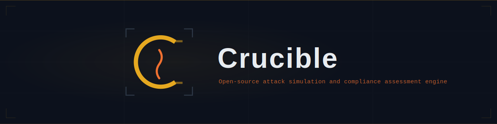

<p align="center">
  
</p>

# Crucible

Next-generation security testing platform. Crucible provides a catalog of 80+ attack scenarios, a visual scenario editor, a real-time simulation engine, and pass/fail assessment scoring — all orchestrated through a web UI backed by WebSocket streaming.

## Key Features

- **Scenario Catalog** — 80+ pre-built security scenarios covering OWASP API Top 10, web attacks, business logic flaws, compliance checks, and more
- **Visual Editor** — create and modify scenarios with a form-based editor or raw JSON, with live validation
- **Real-time Simulations** — watch step-by-step execution with a live timeline, pause/resume/cancel controls, and variable extraction
- **Assessment Scoring** — run scenarios in assessment mode for a pass/fail verdict with percentage scoring
- **DAG Execution** — steps execute in dependency order with conditional branching, retries, and template variables

## Architecture

```
crucible/
├── packages/crucible       # @atlascrew/crucible — unified server package (npm + Docker)
├── packages/catalog        # @crucible/catalog — scenario schemas, validation, and loader
├── apps/web-client         # Next.js 16 web UI (scenarios, assessments, simulations)
├── apps/demo-dashboard     # Express + WebSocket simulation orchestrator
├── apps/client             # @atlascrew/crucible-client — typed API client library
└── apps/cli                # @atlascrew/crucible-cli — lightweight remote CLI
```

| Package | Stack | Description |
|---------|-------|-------------|
| `@atlascrew/crucible` | Express, Next.js, SQLite | Unified server — bundles the UI, API, engine, and scenario catalog into a single installable |
| `@atlascrew/crucible-client` | TypeScript, native fetch | Typed API client for the Crucible REST and WebSocket APIs — zero runtime dependencies |
| `@atlascrew/crucible-cli` | TypeScript, tsup | Lightweight CLI for interacting with a running Crucible server |
| `@crucible/catalog` | TypeScript, Zod | Scenario type definitions, JSON schema validation, runbook parser |
| `web-client` | Next.js 16, React 19, Tailwind 4, Radix UI | Primary web interface for browsing and editing scenarios |
| `demo-dashboard` | Express, WebSocket | Real-time scenario execution engine with live dashboard |

## Installation

### Server (npm)

```bash
npm install -g @atlascrew/crucible
crucible start
```

Open **http://localhost:3000**. The UI, REST API, and WebSocket endpoint are all served from a single process.

### Server (Docker)

```bash
docker run -p 3000:3000 nickcrew/crucible:latest
```

### API Client Library

```bash
npm install @atlascrew/crucible-client
```

```typescript
import { CrucibleClient } from '@atlascrew/crucible-client';

const client = new CrucibleClient({ baseUrl: 'http://localhost:3000' });
const scenarios = await client.scenarios.list();
const { executionId } = await client.assessments.start('my-scenario');
const execution = await client.executions.get(executionId);
```

Zero runtime dependencies — uses native `fetch` and `WebSocket` (Node 22+).

### Remote CLI

```bash
npm install -g @atlascrew/crucible-cli
```

```bash
crucible-cli health
crucible-cli scenarios
crucible-cli assess my-scenario --fail-below 90
crucible-cli executions --status running,completed
crucible-cli reports abc123 --download pdf -o report.pdf
```

Talks to a running Crucible server over HTTP. Set `CRUCIBLE_URL` or use `--server <url>`.

### Environment Variables

| Variable | Default | Description |
|----------|---------|-------------|
| `PORT` | `3000` | Server port |
| `CRUCIBLE_DB_PATH` | `./data/crucible.db` | SQLite database location |
| `CRUCIBLE_REPORTS_DIR` | `./data/reports` | Assessment report output directory |
| `CRUCIBLE_TARGET_URL` | — | Base URL of the system under test |
| `CRUCIBLE_SCENARIOS_DIR` | *(built-in catalog)* | Path to a custom scenarios directory |
| `CRUCIBLE_MAX_CONCURRENCY` | `3` | Max concurrent scenario executions |

## Development

### Prerequisites

- **Node.js** 22+
- **pnpm** 9.15.4 (activated via `corepack enable`)

### Run from source

```bash
git clone https://github.com/atlas-crew/Crucible.git
cd Crucible
pnpm install
pnpm build
```

Start the backend and frontend in separate terminals:

```bash
# Backend — scenario engine + REST API + WebSocket (port 3001)
pnpm --filter @crucible/demo-dashboard dev

# Frontend — web UI (port 3000)
pnpm --filter web-client dev
```

Open **http://localhost:3000** and verify the **CONNECTED** indicator appears in the header.

> **Note**: In development mode the frontend and backend run on separate ports. The environment variables `NEXT_PUBLIC_API_URL` and `NEXT_PUBLIC_WS_URL` configure the frontend to reach the backend (defaults to `localhost:3001`).

## Documentation

### User Guides

| Guide | Description |
|-------|-------------|
| [Getting Started](docs/user-guides/getting-started.md) | Install, configure, and launch Crucible |
| [Running Scenarios](docs/user-guides/running-scenarios.md) | Browse the catalog, run simulations, and review assessments |
| [Editing Scenarios](docs/user-guides/editing-scenarios.md) | Create and modify scenario definitions |

### Architecture

| Document | Description |
|----------|-------------|
| [System Overview](docs/architecture/system-overview.md) | Component map, data flow diagrams, and communication protocols |
| [Scenario Engine](docs/architecture/scenario-engine.md) | DAG scheduling, step execution, assertions, and WebSocket events |

### Development

| Document | Description |
|----------|-------------|
| [Testing Guide](docs/development/testing/testing-guide.md) | Test infrastructure, conventions, and coverage breakdown |

See the full [Documentation Navigator](docs/NAVIGATOR.md) for all available docs.

## CI/CD

### Pull Request Checks

Every PR to `main` runs build, type-check, and test via [GitHub Actions](.github/workflows/ci.yml).

### Package And Docker Release

Pushing a semver tag triggers npm and Docker publishing:

```bash
git tag v0.3.0
git push origin v0.3.0
```

The release workflow checks each `@atlascrew/*` package against npm and publishes only those with a new version:

| Package | npm | Versioned |
|---------|-----|-----------|
| `@atlascrew/crucible` | [npmjs.com](https://www.npmjs.com/package/@atlascrew/crucible) | Independently |
| `@atlascrew/crucible-client` | [npmjs.com](https://www.npmjs.com/package/@atlascrew/crucible-client) | Independently |
| `@atlascrew/crucible-cli` | [npmjs.com](https://www.npmjs.com/package/@atlascrew/crucible-cli) | Independently |

The Docker image (`nickcrew/crucible`) is tagged with the version from the git tag (e.g. `0.3.0`, `0.3`, `latest`). The release workflow expects `NPM_TOKEN`, `DOCKERHUB_USERNAME`, and `DOCKERHUB_TOKEN` repository secrets.

## Project Commands

| Command | Description |
|---------|-------------|
| `pnpm build` | Build all packages (Nx orchestrated) |
| `pnpm build:release` | Build all publishable `@atlascrew/*` packages |
| `pnpm test` | Run all test suites |
| `pnpm type-check` | TypeScript type checking across all packages |
| `pnpm lint` | Lint all packages |
